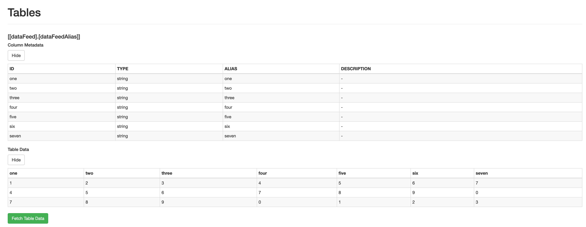

# Tableau WDC Frontend with React in Typescript

Ouputs HTML page and encapsulates the frontend logic

## Examples

checkout `example.ts`

## Run and test

### Simulator
https://tableau.github.io/webdataconnector/Simulator/ and add the url https://nexysweb.github.io/tableau-wdc-react/ in `connector url`

### Notes

* use of react (will not work with old versions of Tableau)
* use of `fetch`
* for illustration purpose, the demo fetches json attached to the project, in real life the endpoint should be hooked up to a backend